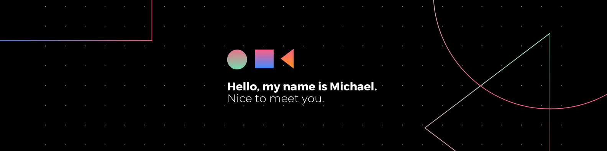

Hey there👋🏾

I'm Michael, a Product Operations Specialist turned Software Engineer. Highly motivated and experienced individual with several years of expertise working in technical product development. I am driven to build software solutions that solve everyday problems and positively impact the lives of people worldwide.

## 📌 Pinned Repositories

## 📈 GitHub Stats

 

## 💼 Skills

